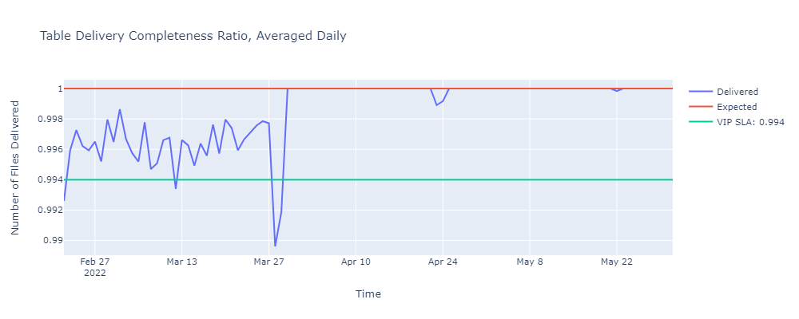

# VIP Data Lake Glue Pipeline

The present script  is flattened but ti is recommended to isolate the main code from dependencies (credentials, librairies, helper functions and modules). 
On AWS Glue, dependencies can be isolated as follows:
- Credentials: Into AWS Secrete Manager and called via a function (get_secrets())
```python
def get_secrets():
    """
    Requires credentials to be placed in AWS secret manager
    """
    client = boto3.client('secretsmanager')
    response = client.get_secret_value(
        SecretId='<Your_Secret_Name>'
    )
    database_secrets = json.loads(response['SecretString'])
    return database_secrets
```

If AWS secret manager is not available, the following lines (362-366 v.1.0) needs to be mitigated via another solution following the pattern below:
(Secrets available under request)
````python
client_secret=dev_secrets['Veson_client_secret']
client_id=dev_secrets['Veson_client_id']
bucket=dev_secrets['AWS_bucket']
access_key_id=dev_secrets['AWS_access_key_id']
secret_key_id=dev_secrets['AWS_secret_key_id']
````
- Libraries, helper functions & modules: separate files on S3. Paths to these files are called in AWS Glue > Job Details > Advanced Properties > Libraries > Python library path
OR Referenced files path (paths separated with commas)

## VIP Data Lake API in a nutshell
Access to the VIP Data Lake is a 4 step process:
1) Get a valid token (valid 60 minutes) (POST)
2) Trigger a job (allowed only once per hour) (POST)
3) Check job status (to be run every n seconds until the 'Completed'response is returned)
4) Get the list of presigned urls to access files

This script does the following :
1) Automate the whole API process (steps 1 to 4)
2) Create folders on S3 to receive the files
3) Parse the presigned urls to upload files to S3
4) Sanity check: ensure that all files promised on the presigned urls are successfully uploaded

## Environments
**Test and Prod**:

The API provides two threads with distinct configNames:
-onDemandExtract1DayTest
-onDemandExtract1DayProd
In test environment, the onDemandExtract1DayTest job config is used and the prefix on S3 is 'DEV/IMOSDL/Hourly/<hourly job folder>'.
    
In Prod environment, the onDemandExtract1DayProd job config is used and the prefix on S3 is 'IMOSDL/Hourly/<hourly job folder>'.
    
You can swap environments via the 'environmentType'variable ('Test'or 'Prod') in the script
    
## Good to know
Job typical cycle:
1) Init phase: < 2 minutes
2) Replication phase on Veson's side: 15-25 minutes
3) Files upload to S3 with sanity check: 2-3 minutes
              
     
# Telemetry and Data Observability
The VIP Data Lake is a young product and not yet fully mature. The process is still under optimization on Veson's side, and the following situations might be expected:
- Unsuccessful replication job(s) for any reasons (abnormal timeout reached on the API side, AWS changes (S3 policies, secrets rotation etc.)
- Incomplete replication job(s): tables are missing
- Unexpected data volumes (missing tables, additional tables or fields exposed, changes in the lookback window logic for snapshots, schema upgrade, etc...)
                  
 It is therefore strongly recommended to thoroughly monitor and observe the pipeline behaviors to identitfy and notify any abnormal situations that might affects data quality before it impacts the business.

The following observability principles are handled thanks to the provided code (helper function file + dependencies + jupyter notebook)
The code with dependencies are in the 'DataObservability' folder ehre https://git.cglcloud.com/OT-Data-Team/vesslink_api/tree/main/DataObservability
                  
 ## Concept
The idea behind these scripts is to observe certain crtitical aspects of the pipeline and a trace of the data quality history as csv files. This process is just a proposition and is of course not exhaustive. The processes exposed here were particularly useful to monitor the pipeline stability and served as guidelines for development, testing and integration. For this pipeline, things might go wrong in different ways: from proxy issues on-prems, API issues, schema changes, Veson's backend issues, to AWS outages (IAM role or secret modifcationS), all of them can impact the data quality as follows:
- Missing jobs
- Incomplete jobs (missing tables)
- Unexpected data volumes (too low or too high, missing data)
- Unexpected data (not aligned with the provided schema)

All of the above can lead to a lack of trust in data and it is therefore recommended to understand the pipeline behavior thanks to data observability, which will provide an informed context for actions. Apart from having the possibility to identify the source and the reasons for the pipeline outage, this will also be useful to measure and understand if we are in or out of SLAs or SLOs.
                  
## Dependencies
- Python libraries (see in the script)
- Helper Functions Python file https://git.cglcloud.com/OT-Data-Team/vesslink_api/blob/main/DataObservability/VIP_data_observability_helper_function.py
- Secrets (AWS, Veson, Cargill Proxy) !the provided files are anoymized, replace credentials by yours and ensure they are in the safe place
- Historical data observability csv files 

A Jupyter notebook (https://git.cglcloud.com/OT-Data-Team/vesslink_api/tree/main/DataObservability) is provided to showcase what can be done around telemetry and data observability.
If run hourly, just after the end of a Glue job, the data observability process takes a just few seconds. Here, the data observability results are incremental, written on an existing historical csv file. Code is provided to generate these original historical if not existing, just be aware that the process can take 1-2 hours to complete.

## State of the Provided Historical Data
To better understand the historical data provided here:
- Data repo: s3usameacraftsmandev (IMOS prefix)
- Timeline: 2022/02/08 08:00 to 2022/05/31 08:00 included
 These parameters can be customized in the code

## How to
One of the first step will be to ensure your S3 bucket includse all the jobs uploaded so far => copy every missing jobs from s3usameacraftsmandev/IMOS/Hourly to you S3. Be careful not to mix jobs from different configNames (Prod and Test flows, as we do not know if they are exactly the same or not). Remind that a test with the Prod configName has redirected the Prod flow to your S3 from 2022/05/10 13:00 included to 2022/05/11 10:00 included: these files are absent from s3usameacraftsmandev. 

Once the jobs are consolidated, it is recommended to initialize and generate the historical data observability csv files (1-2 hours). After the creation of the histoircal files, the scripts are incremental and process only the missing time points since the last execution.
    
## Provided Data Observability rules
The scripts allows to generate and update the following datasets:
- historical_job_metrics.csv (https://git.cglcloud.com/OT-Data-Team/vesslink_api/blob/main/DataObservability/historical_job_metrics.csv)
- historical_table_metrics.csv (https://git.cglcloud.com/OT-Data-Team/vesslink_api/blob/main/DataObservability/historical_table_metrics.csv)
- historical_job_size.csv (https://git.cglcloud.com/OT-Data-Team/vesslink_api/blob/main/DataObservability/historical_job_size.csv)
    
These initial datasets are composed of hourly records, the script provides tools to aggregate the data for a daily view. The data visulaisation tool used is Plotly (interactive and easy to use). This is just for demonstration purposes.

## Examples of Data Observability Visulaizations:
### Volumetry
- Files Delivered (partitions, schema, scripts included) in Successful Jobs, Hourly

- Size of Files Delivered (partitions, schema, scripts included), Hourly

### Job Level Completeness
- Job Delivery Completeness, Averaged Daily

- Job Delivery Completeness Ratio, Averaged Daily

- Job Delivery Completeness (out of 1, hourly)

### Table Level Completeness
- Table Delivery Completeness, Averaged Daily

- Table Delivery Completeness Ratio, Averaged Daily

- Table Delivery Completeness, Hourly

- Table Delivery Failure, Averaged Daily

- Table Delivery Failure, Hourly

